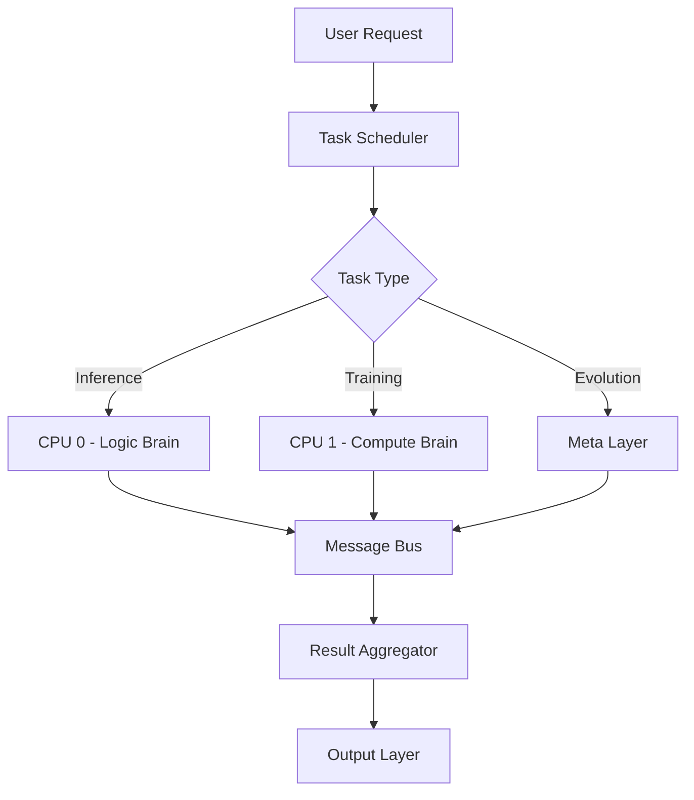

# Brain OS - Neural Operating System Architecture

## 🧠 Overview

Brain OS là hệ điều hành thần kinh trung tâm cho kiến trúc Brain Map, hoạt động như kernel + scheduler + registry cho tất cả các agent/não bộ trong hệ thống AmazeBid tự tiến hóa.

---

## 🏗️ Architecture Layers

### 1. Kernel Layer (Hạt nhân thần kinh)

#### Agent Registry
```typescript
interface Agent {
  agent_id: string;
  role: string;
  cpu_affinity: "cpu0" | "cpu1" | "any";
  capabilities: string[];
  input_types: string[];
  output_types: string[];
  priority: number;
  status: "active" | "inactive" | "evolving";
}
```

#### Task Scheduler
```typescript
interface Task {
  task_id: string;
  type: "inference" | "training" | "evolution" | "analysis";
  origin: "api" | "meta" | "scheduler";
  payload: any;
  constraints: {
    latency_ms: number;
    max_cost: number;
    cpu: "cpu0" | "cpu1" | "any";
    priority: number;
  };
  context_ref?: string;
  deadline?: Date;
}
```

#### Message Bus Adapter
```typescript
interface Message {
  message_id: string;
  type: "task" | "result" | "event" | "error";
  from_agent: string;
  to_agent?: string;
  timestamp: Date;
  payload: any;
  metadata?: any;
}
```

### 2. Cognitive Layer (Tầng nhận thức)

#### Services
- **Canonicalization Service**: Chuẩn hóa input/output
- **Planning Service**: Lập kế hoạch thực thi
- **Memory Service**: Quản lý vector DB, metadata, KPI
- **Decision Service**: Selector và policy routing

### 3. Evolution Layer (Tầng tiến hóa)

#### Meta Components
- **Meta-Observer**: Giám sát KPI và hiệu suất
- **Meta-Analyzer**: Phân tích vấn đề và cơ hội
- **Meta-Planner**: Lập kế hoạch tiến hóa
- **Architect + CodeGen Orchestrator**: Tạo kiến trúc và code mới
- **Experiment Orchestrator**: Thực hiện thử nghiệm
- **Rollout Controller**: Triển khai và cập nhật

---

## 🔄 Task Execution Flow



---

## 📋 Plan Format

```typescript
interface Plan {
  plan_id: string;
  created_at: Date;
  steps: PlanStep[];
  status: "pending" | "running" | "completed" | "failed";
  result?: any;
}

interface PlanStep {
  step_id: string;
  step: string;
  agent: string;
  input_from?: string;
  output_to?: string;
  timeout_ms: number;
  retry_count: number;
  status: "pending" | "running" | "completed" | "failed";
}
```

---

## 🎯 Scheduling Rules

### CPU Allocation Rules
1. **Logic → CPU 0**
   - `planner`, `canonicalizer`, `selector`, `meta-*`
   
2. **Compute → CPU 1**
   - `data_processor`, `embedding_engine`, `model_runner`, `experiment_runner`
   
3. **Cross-CPU Communication**
   - Chỉ qua Message Bus
   - Không direct memory sharing

### Priority Rules
1. **Inference** (online) - Priority: 1
2. **Evolution** (offline) - Priority: 2  
3. **Logging** (background) - Priority: 3

---

## 🛠️ Implementation Structure

### CPU 0 - Node.js (Logic Brain)
```
brain-os/
├── brain-kernel/
│   ├── agent-registry.ts
│   ├── task-scheduler.ts
│   ├── message-bus-adapter.ts
│   ├── routing-rules.ts
│   └── error-recovery.ts
├── cortex/
│   ├── canonicalizer.ts
│   ├── planner.ts
│   ├── selector.ts
│   ├── meta-observer.ts
│   ├── meta-analyzer.ts
│   └── meta-planner.ts
└── services/
    ├── memory-service.ts
    ├── decision-service.ts
    └── canonicalization-service.ts
```

### CPU 1 - Python (Compute Brain)
```
compute-brain/
├── core/
│   ├── data_processor.py
│   ├── embedding_engine.py
│   ├── model_runner.py
│   ├── evaluator.py
│   └── experiment_runner.py
├── evolution/
│   ├── architect.py
│   ├── code_generator.py
│   └── rollout_controller.py
└── utils/
    ├── message_client.py
    └── performance_monitor.py
```

---

## 📝 OS Contracts

### 1. Task Contract
```typescript
// Standardized task format across all agents
const taskContract = {
  required_fields: ["task_id", "type", "origin", "payload"],
  optional_fields: ["constraints", "context_ref", "deadline"],
  validation_rules: {
    type: ["inference", "training", "evolution", "analysis"],
    cpu: ["cpu0", "cpu1", "any"]
  }
};
```

### 2. Agent Registry Contract
```typescript
// Agent registration and discovery
const agentContract = {
  required_fields: ["agent_id", "role", "cpu_affinity"],
  capability_format: "string_array",
  priority_range: [1, 10],
  status_values: ["active", "inactive", "evolving"]
};
```

### 3. Plan Contract
```typescript
// Execution plan format
const planContract = {
  required_fields: ["plan_id", "steps"],
  step_requirements: ["step", "agent", "timeout_ms"],
  step_optional: ["input_from", "output_to", "retry_count"]
};
```

---

## 🚀 Key Features

### 1. **Auto-Discovery**
- Agents tự đăng ký khi khởi động
- Dynamic capability detection
- Real-time status monitoring

### 2. **Intelligent Scheduling**
- CPU-aware task assignment
- Priority-based execution
- Deadline-aware scheduling

### 3. **Fault Tolerance**
- Automatic retry mechanisms
- Fallback agent selection
- Graceful degradation

### 4. **Evolution Support**
- Hot-swappable agents
- A/B testing framework
- Canary deployment support

### 5. **Performance Monitoring**
- Real-time KPI tracking
- Agent performance metrics
- System health dashboard

---

## 🔧 Configuration

### Brain OS Config
```json
{
  "brain_os": {
    "max_concurrent_tasks": 100,
    "task_timeout_ms": 30000,
    "message_buffer_size": 1000,
    "health_check_interval_ms": 5000
  },
  "cpu0": {
    "max_agents": 20,
    "memory_limit_mb": 1024
  },
  "cpu1": {
    "max_agents": 15,
    "memory_limit_mb": 2048
  }
}
```

### Agent Config Example
```json
{
  "agent_id": "canonicalizer",
  "role": "language_processing",
  "cpu_affinity": "cpu0",
  "capabilities": ["text_normalization", "structure_parsing"],
  "input_types": ["raw_request"],
  "output_types": ["canonical_request"],
  "priority": 8,
  "max_concurrent_tasks": 10
}
```

---

## 📊 Performance Metrics

### System-Level Metrics
- **Task Throughput**: Tasks/second per CPU
- **Latency Distribution**: P50, P95, P99 latencies
- **Error Rate**: Failed tasks/total tasks
- **Resource Utilization**: CPU, memory usage

### Agent-Level Metrics
- **Response Time**: Average task completion time
- **Success Rate**: Successful tasks/total tasks
- **Queue Depth**: Pending tasks per agent
- **Evolution Cycles**: Number of self-improvements

---

## 🎯 Use Cases for AmazeBid

### 1. **Product Search**
```typescript
const searchTask: Task = {
  task_id: generateUUID(),
  type: "inference",
  origin: "api",
  payload: { query: "bu lông thép M8", filters: {} },
  constraints: { latency_ms: 200, max_cost: 0.01, cpu: "any" }
};
```

### 2. **Model Evolution**
```typescript
const evolutionTask: Task = {
  task_id: generateUUID(),
  type: "evolution",
  origin: "meta",
  payload: { model_type: "transformer", optimization_target: "accuracy" },
  constraints: { latency_ms: 5000, max_cost: 0.10, cpu: "cpu1" }
};
```

### 3. **Performance Analysis**
```typescript
const analysisTask: Task = {
  task_id: generateUUID(),
  type: "analysis",
  origin: "meta",
  payload: { metric: "accuracy", time_range: "24h" },
  constraints: { latency_ms: 1000, max_cost: 0.05, cpu: "cpu0" }
};
```

---

## 🔮 Future Enhancements

### 1. **Multi-Node Support**
- Extend beyond 2 CPUs
- Cluster management
- Load balancing across nodes

### 2. **GPU Integration**
- CUDA-aware scheduling
- Model parallelism
- Mixed CPU/GPU workflows

### 3. **Advanced Evolution**
- Neural architecture search
- AutoML integration
- Reinforcement learning

### 4. **Real-time Collaboration**
- Multi-tenant support
- Resource isolation
- Dynamic scaling

---

Brain OS cung cấp nền tảng vững chắc cho hệ thống AI tự tiến hóa, cho phép các agent hoạt động phối hợp hiệu quả và liên tục cải tiến qua thời gian.
