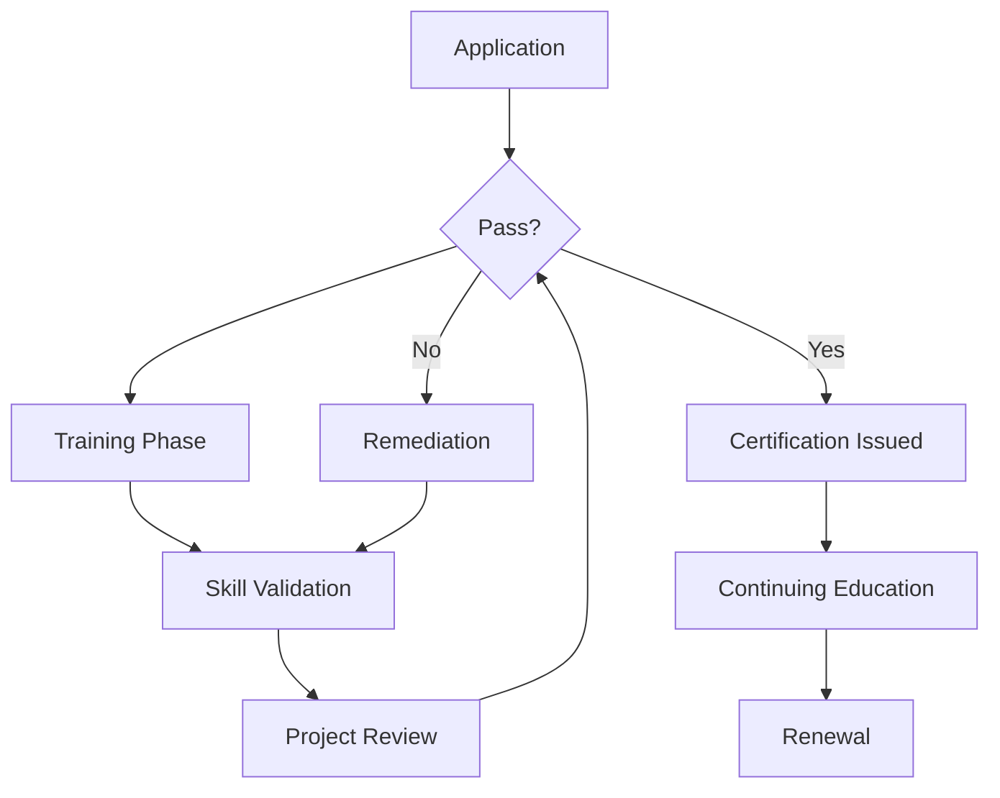

# Pilot Training Program Implementation Plan

## 🎯 Tổng quan

Kế hoạch triển khai pilot training program với 10 participants, 2 trainers, và infrastructure hoàn chỉnh để đảm bảo quality assurance và hiệu quả đào tạo tối ưu.

---

## 👥 Team Structure & Roles

### **Training Team**

#### **Technical Trainer (1)**
```
Chuyên môn:
- Template engine architecture
- Content generation algorithms
- Quality control systems
- API integration
- Performance optimization

Trách nhiệm:
- Foundation training (Weeks 1-4)
- Technical exercise development
- Code review và feedback
- System integration guidance

Yêu cầu:
- 5+ years experience trong content generation systems
- Deep knowledge của template architecture
- Strong programming skills (JavaScript, Python)
- Training và mentoring experience
```

#### **Industry Expert Trainer (1)**
```
Chuyên môn:
- Industry-specific content requirements
- Regulatory compliance
- Market trends và applications
- Business case development
- Customer success stories

Trách nhiệm:
- Industry specialization training (Weeks 5-8)
- Real-world case studies
- Business context integration
- Industry-specific assessments

Yêu cầu:
- 10+ years industry experience (manufacturing, electronics, services)
- Deep understanding of technical documentation
- Business analysis skills
- Client-facing experience
```

### **Support Team**

#### **Program Coordinator (1)**
```
Trách nhiệm:
- Participant onboarding
- Schedule management
- Resource coordination
- Progress tracking
- Communication hub

Skills:
- Project management
- Communication skills
- Attention to detail
- Time management
```

#### **Technical Support (1)**
```
Trách nhiệm:
- Development environment setup
- System maintenance
- Troubleshooting
- Platform access management
- Performance monitoring

Skills:
- DevOps experience
- System administration
- Technical troubleshooting
- Customer support
```

---

## 👨‍🎓 Participant Selection Criteria

### **Target Profile**
```
Ideal Participants:
- Technical writers với 2+ years experience
- Content creators trong technical domains
- Product managers trong B2B companies
- Marketing specialists trong industrial sectors
- AI agents cần training enhancement
```

### **Selection Process**

#### **Application Requirements**
```
1. Professional Background
   - Current role và responsibilities
   - Years of experience
   - Industry exposure

2. Technical Assessment
   - Basic technical writing sample
   - Template usage experience
   - Quality control knowledge

3. Learning Objectives
   - Specific goals for the training
   - Expected applications
   - Success metrics

4. Commitment Agreement
   - Time availability (10 hours/week)
   - Project completion commitment
   - Feedback participation
```

#### **Screening Rubric**
```
Criteria (Weight) | Excellent (10) | Good (8) | Satisfactory (6) | Poor (4)
------------------|----------------|----------|----------------|---------
Technical Background (30%) | Deep technical writing experience | Good technical background | Basic technical skills | Limited technical experience
Industry Knowledge (25%) | Multiple industry exposure | Single industry expertise | Basic industry knowledge | No industry experience
Learning Motivation (20%) | Clear goals, high commitment | Good motivation | Basic interest | Low motivation
Time Availability (15%) | Fully available | Mostly available | Limited availability | Poor availability
Collaboration Skills (10%) | Strong team player | Good collaborator | Basic teamwork skills | Poor collaboration

Minimum Score: 70/100 to qualify
```

---

## 🖥️ Development Environment Setup

### **Infrastructure Architecture**

#### **Cloud Environment**
```
Platform: AWS/Azure/GCP
Components:
- Training LMS (Moodle or Canvas)
- Development Environment (VS Code Online)
- Template Repository (Git)
- Assessment Platform (Custom)
- Communication Tools (Slack/Discord)
- File Storage (S3/Blob Storage)
```

#### **Development Environment**
```yaml
# docker-compose.yml for training environment
version: '3.8'
services:
  training-platform:
    image: content-generator/training:latest
    ports:
      - "3000:3000"
    environment:
      - NODE_ENV=development
      - TEMPLATE_LIBRARY_PATH=/templates
      - ASSESSMENT_DB_URL=postgresql://user:pass@db:5432/training
    volumes:
      - ./templates:/templates
      - ./exercises:/exercises
      - ./submissions:/submissions
    depends_on:
      - db
      - redis

  db:
    image: postgres:14
    environment:
      - POSTGRES_DB=training
      - POSTGRES_USER=user
      - POSTGRES_PASSWORD=pass
    volumes:
      - postgres_data:/var/lib/postgresql/data

  redis:
    image: redis:7-alpine
    ports:
      - "6379:6379"

  template-engine:
    image: content-generator/engine:latest
    ports:
      - "8080:8080"
    environment:
      - TEMPLATE_PATH=/templates
      - CACHE_ENABLED=true
    volumes:
      - ./templates:/templates

  assessment-service:
    image: content-generator/assessment:latest
    ports:
      - "9090:9090"
    environment:
      - DB_URL=postgresql://user:pass@db:5432/training
    depends_on:
      - db

volumes:
  postgres_data:
```

#### **Template Library Structure**
```
/templates/
├── industrial/
│   ├── bolt/
│   │   ├── template.json
│   │   ├── variables.json
│   │   ├── examples/
│   │   └── validation.json
│   ├── resistor/
│   ├── bearing/
│   └── capacitor/
├── consumer_electronics/
│   ├── mobile_app/
│   └── appliance/
├── services/
│   └── consulting/
├── digital_products/
│   └── online_course/
└── packaging/
    └── primary_packaging/
```

### **Access Management**

#### **User Roles & Permissions**
```javascript
const userRoles = {
  participant: {
    permissions: [
      'view_templates',
      'generate_content',
      'submit_exercises',
      'view_progress',
      'access_materials'
    ],
    restrictions: [
      'modify_templates',
      'view_others_work',
      'access_admin_tools'
    ]
  },
  
  trainer: {
    permissions: [
      'view_templates',
      'modify_templates',
      'review_submissions',
      'provide_feedback',
      'manage_assessments',
      'view_analytics'
    ],
    restrictions: [
      'delete_system_data',
      'modify_user_roles'
    ]
  },
  
  admin: {
    permissions: [
      'all_permissions'
    ]
  }
};
```

#### **Authentication System**
```javascript
// Authentication setup
const authConfig = {
  provider: 'OAuth2',
  providers: ['Google', 'Microsoft', 'GitHub'],
  mfa_required: true,
  session_timeout: '8 hours',
  max_concurrent_sessions: 2
};

// User onboarding flow
const onboardingProcess = {
  step1: 'Account creation and email verification',
  step2: 'Profile setup and skills assessment',
  step3: 'Environment access and tutorial',
  step4: 'Welcome session and icebreaker',
  step5: 'First exercise assignment'
};
```

---

## 📊 Assessment Platform Design

### **Assessment Architecture**

#### **Assessment Types**
```javascript
const assessmentTypes = {
  formative: {
    purpose: 'Learning progress monitoring',
    frequency: 'Weekly',
    weight: '30%',
    types: ['quizzes', 'exercises', 'peer_reviews']
  },
  
  summative: {
    purpose: 'Skill validation',
    frequency: 'Monthly',
    weight: '50%',
    types: ['projects', 'practical_exams', 'case_studies']
  },
  
  diagnostic: {
    purpose: 'Skill gap identification',
    frequency: 'Pre/Post training',
    weight: '20%',
    types: ['skill_assessments', 'knowledge_tests']
  }
};
```

#### **Scoring System**
```javascript
const scoringSystem = {
  technical_accuracy: {
    weight: 0.3,
    metrics: ['correctness', 'precision', 'completeness'],
    calculation: 'automated + manual_review'
  },
  
  content_quality: {
    weight: 0.25,
    metrics: ['readability', 'structure', 'engagement'],
    calculation: 'ai_analysis + human_review'
  },
  
  template_usage: {
    weight: 0.2,
    metrics: ['proper_selection', 'variable_usage', 'customization'],
    calculation: 'automated_validation'
  },
  
  innovation: {
    weight: 0.15,
    metrics: ['creativity', 'problem_solving', 'improvement'],
    calculation: 'expert_review'
  },
  
  collaboration: {
    weight: 0.1,
    metrics: ['peer_feedback', 'participation', 'mentorship'],
    calculation: 'peer_assessment'
  }
};
```

### **Quality Assurance Framework**

#### **Multi-Level Review Process**
```
Level 1: Automated Validation
- Template compliance checking
- Technical accuracy verification
- Format validation
- Plagiarism detection

Level 2: Peer Review
- Structured feedback system
- Anonymous review process
- Rating system (1-5 stars)
- Improvement suggestions

Level 3: Expert Review
- Trainer assessment
- Industry expert validation
- Quality benchmarking
- Certification readiness

Level 4: External Validation
- Industry partner feedback
- Real-world testing
- Customer acceptance
- Market validation
```

#### **Quality Metrics Dashboard**
```javascript
const qualityMetrics = {
  overall_quality: {
    target: 85,
    current: 0,
    trend: 'increasing'
  },
  
  technical_accuracy: {
    target: 95,
    current: 0,
    trend: 'stable'
  },
  
  user_satisfaction: {
    target: 4.5,
    current: 0,
    scale: '1-5'
  },
  
  completion_rate: {
    target: 90,
    current: 0,
    trend: 'monitoring'
  },
  
  time_to_proficiency: {
    target: '6 weeks',
    current: 0,
    measurement: 'average_time'
  }
};
```

---

## 🏆 Certification System

### **Certification Workflow**

#### **Certification Process**


#### **Digital Certificate System**
```javascript
const certificateConfig = {
  blockchain_enabled: true,
  verifiable_credentials: true,
  qr_code_verification: true,
  employer_verification: true,
  public_profile: true,
  skill_badges: true,
  continuing_education_tracking: true
};

const certificateTemplate = {
  level1: {
    title: 'Certified Content Generator',
    skills: ['template_usage', 'technical_writing', 'quality_control'],
    validity: '1 year',
    ce_credits_required: 12
  },
  
  level2: {
    title: 'Certified Content Specialist',
    skills: ['industry_expertise', 'advanced_customization', 'compliance'],
    validity: '2 years',
    ce_credits_required: 24
  },
  
  level3: {
    title: 'Certified Content Expert',
    skills: ['system_integration', 'performance_optimization', 'training'],
    validity: '3 years',
    ce_credits_required: 36
  },
  
  level4: {
    title: 'Certified Content Master',
    skills: ['innovation', 'architecture', 'leadership'],
    validity: '5 years',
    ce_credits_required: 50
  }
};
```

---

## 📅 Implementation Timeline

### **Phase 1: Preparation (Weeks 1-2)**

#### **Week 1: Infrastructure Setup**
```
Day 1-2: Environment deployment
- Cloud infrastructure setup
- Development environment configuration
- Template library deployment
- Assessment platform setup

Day 3-4: System integration
- API connections
- User authentication setup
- Data migration
- Security configuration

Day 5: Testing & validation
- System testing
- Performance validation
- Security audit
- Backup procedures
```

#### **Week 2: Content Preparation**
```
Day 1-2: Training materials
- Exercise development
- Assessment creation
- Template customization
- Documentation preparation

Day 3-4: Trainer preparation
- Trainer onboarding
- Material review
- Practice sessions
- Quality assurance

Day 5: Participant onboarding
- Application processing
- Account creation
- Welcome materials
- Orientation scheduling
```

### **Phase 2: Training Execution (Weeks 3-12)**

#### **Weeks 3-6: Foundation Training**
```
Schedule:
- Monday: Technical content (2 hours)
- Tuesday: Practical exercises (2 hours)
- Wednesday: Review & feedback (1 hour)
- Thursday: Industry context (1 hour)
- Friday: Assessment & progress (1 hour)

Weekly Deliverables:
- 3 completed exercises
- 1 peer review
- 1 progress report
- 1 weekly assessment
```

#### **Weeks 7-10: Specialization Training**
```
Schedule:
- Monday: Industry deep dive (2 hours)
- Tuesday: Advanced exercises (2 hours)
- Wednesday: Case studies (2 hours)
- Thursday: Project work (2 hours)
- Friday: Presentations (1 hour)

Bi-weekly Deliverables:
- 2 industry-specific projects
- 1 case study analysis
- 1 presentation
- 1 peer mentoring session
```

#### **Weeks 11-12: Capstone & Assessment**
```
Activities:
- Capstone project development
- Final assessments
- Certification preparation
- Program evaluation
- Graduation ceremony

Deliverables:
- 1 capstone project
- Final portfolio
- Certification application
- Program feedback
```

### **Phase 3: Follow-up (Weeks 13-16)**

#### **Weeks 13-14: Certification Processing**
```
Activities:
- Final assessment grading
- Certificate issuance
- Profile creation
- Alumni network setup

Deliverables:
- Digital certificates
- Public profiles
- Skill badges
- Alumni access
```

#### **Weeks 15-16: Program Evaluation**
```
Activities:
- Data analysis
- Feedback collection
- Improvement identification
- Report generation

Deliverables:
- Program report
- Improvement plan
- Success metrics
- Lessons learned
```

---

## 💰 Budget Allocation

### **Total Budget: $75,000**

#### **Personnel Costs ($45,000)**
```
Technical Trainer: $25,000 (10 weeks @ $2,500/week)
Industry Expert Trainer: $15,000 (10 weeks @ $1,500/week)
Program Coordinator: $3,000 (10 weeks @ $300/week)
Technical Support: $2,000 (10 weeks @ $200/week)
```

#### **Infrastructure Costs ($15,000)**
```
Cloud Infrastructure: $5,000
Development Environment: $3,000
Assessment Platform: $4,000
Communication Tools: $1,000
Security & Compliance: $2,000
```

#### **Content Development ($10,000)**
```
Training Materials: $4,000
Exercise Development: $3,000
Assessment Creation: $2,000
Template Customization: $1,000
```

#### **Program Management ($5,000)**
```
Participant Onboarding: $1,000
Quality Assurance: $2,000
Certification System: $1,000
Program Evaluation: $1,000
```

---

## 📊 Success Metrics & KPIs

### **Training Effectiveness Metrics**

#### **Learning Outcomes**
```
Target Metrics:
- Knowledge retention: 85%+
- Skill acquisition: 90%+
- Practical application: 95%+
- Satisfaction score: 4.5/5+

Measurement Methods:
- Pre/post assessments
- Exercise completion rates
- Project quality scores
- Participant feedback surveys
```

#### **Program Efficiency**
```
Target Metrics:
- On-time completion: 95%+
- System uptime: 99%+
- Response time: <24 hours
- Support satisfaction: 4.5/5+

Measurement Methods:
- Progress tracking
- System monitoring
- Support ticket analysis
- Feedback collection
```

#### **Business Impact**
```
Target Metrics:
- Productivity improvement: 30%+
- Quality improvement: 40%+
- Error reduction: 50%+
- Time to proficiency: 6 weeks

Measurement Methods:
- Performance metrics
- Quality audits
- Error tracking
- Time analysis
```

### **Quality Assurance Metrics**

#### **Content Quality**
```
Metrics:
- Technical accuracy: 95%+
- Template compliance: 100%
- Industry relevance: 90%+
- User friendliness: 85%+

Monitoring:
- Automated validation
- Expert review
- Peer feedback
- User testing
```

#### **System Performance**
```
Metrics:
- Generation speed: <2 seconds
- System availability: 99.9%
- Error rate: <1%
- User satisfaction: 4.5/5+

Monitoring:
- Performance monitoring
- Error tracking
- User analytics
- System health checks
```

---

## 🚀 Risk Management & Mitigation

### **Identified Risks**

#### **Technical Risks**
```
Risk: System downtime during training
Mitigation: 
- Redundant infrastructure
- Backup systems
- 24/7 monitoring
- Rapid response team

Risk: Template compatibility issues
Mitigation:
- Comprehensive testing
- Version control
- Rollback procedures
- Technical support
```

#### **Participant Risks**
```
Risk: Participant drop-out
Mitigation:
- Engagement monitoring
- Early intervention
- Flexible scheduling
- Support systems

Risk: Learning curve too steep
Mitigation:
- Paced learning
- Additional resources
- Peer support
- Tutoring sessions
```

#### **Quality Risks**
```
Risk: Inconsistent assessment standards
Mitigation:
- Clear rubrics
- Calibration sessions
- Multiple reviewers
- Quality audits

Risk: Certification credibility
Mitigation:
- Industry validation
- External verification
- Continuous improvement
- Transparency
```

---

## 📈 Continuous Improvement Plan

### **Feedback Loops**

#### **Weekly Feedback**
```
Methods:
- Participant surveys
- Trainer debriefs
- System analytics
- Quality metrics

Actions:
- Immediate adjustments
- Resource allocation
- Process improvements
- Communication updates
```

#### **Monthly Reviews**
```
Methods:
- Progress analysis
- Stakeholder feedback
- Performance metrics
- Budget review

Actions:
- Strategic adjustments
- Resource optimization
- Process refinement
- Planning updates
```

#### **Program Evaluation**
```
Methods:
- Comprehensive analysis
- Stakeholder interviews
- Success story collection
- Lessons learned documentation

Actions:
- Program redesign
- Best practice documentation
- Knowledge sharing
- Future planning
```

---

*Kế hoạch này cung cấp framework hoàn chỉnh để triển khai pilot training program với focus vào quality assurance, participant success, và measurable outcomes.*
